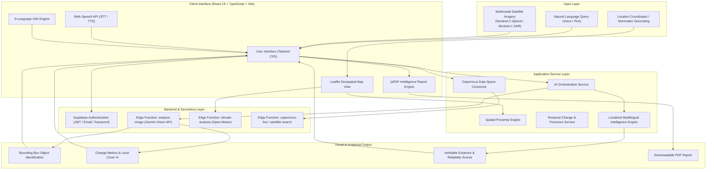

# SatQuery AI

**Interactive Multimodal Vision-Language Assistant for Remote Sensing Image Analysis**

Developed with ❤️ by **Team SpaceSync**

> **Project Status**: SatQuery AI is a prototype developed by Team SpaceSync to demonstrate an AI-assisted approach to interacting with and analysing multimodal satellite imagery through natural-language queries.

---

## 📌 Problem Statement

Satellite imagery from missions such as Sentinel-1 and Sentinel-2 is freely available through open-access earth observation initiatives like Copernicus Data Space. However, effectively extracting actionable intelligence from this data remains challenging for students, researchers, agricultural analysts, urban planners, and disaster responders.

Conventional remote sensing software requires extensive training in band combinations, radiometric indices (NDVI, NDWI), SAR speckle filtering, and complex GIS workflows. Users frequently have access to satellite imagery but lack the specialized tools or technical knowledge required to interpret what the imagery shows.

**SatQuery AI** solves this barrier by providing an interactive vision-language assistant that translates natural-language queries into remote sensing analyses, returning clear visual evidence, object identification, change metrics, and domain-specific reports.

---

## 💡 Core Idea

Instead of requiring manual band manipulation and specialized GIS software, SatQuery AI allows users to communicate directly with satellite imagery using plain language:

```
"What changed between these two images?"
"Are there signs of urban expansion or new construction near this road?"
"Identify water bodies and calculate the flooded area."
"Show vegetation health and identify agricultural stress."
```

The system:
1. Accepts user queries in plain language (text or voice across 9 languages).
2. Interprets the user's intent and selects the appropriate analysis pipeline.
3. Examines the multimodal imagery (Optical RGB/NIR and SAR VV/VH).
4. Generates bounding-box object detections, land cover breakdowns, and change percentages.
5. Returns human-readable explanations accompanied by verifiable evidence, interactive maps, and downloadable PDF reports.

---

## 🚀 Key Capabilities

All features listed below are implemented and functional within the SatQuery AI prototype:

| Capability | Description |
| :--- | :--- |
| **Natural Language Querying** | Free-form natural language question answering on uploaded or selected satellite imagery. |
| **Multimodal Satellite Analysis** | Supports single-image inspection, dual-image comparison, before/after temporal analysis, and combined **Optical + SAR** fusion. |
| **Synthetic Aperture Radar (SAR) Support** | Interprets Sentinel-1 SAR imagery (C-band dual polarization VV/VH) alongside Sentinel-2 multispectral optical bands. |
| **Target Object Identification & Highlighting** | Automatically identifies and draws bounding-box overlays for buildings, road networks, water bodies, and agricultural plots. |
| **Change Detection & Growth Metrics** | Quantifies surface changes over time (vegetation loss/gain, water body expansion/shrinkage, built-up growth). |
| **Land Cover Understanding** | Classifies land cover distribution into categorized percentage breakdowns with thematic color coding. |
| **Area Measurements** | Provides square-kilometer ($\text{km}^2$) coverage estimations for detected features and surface anomalies. |
| **Domain-Specific Analysis Modes** | Specialized modes with custom reasoning templates: <br>• **Disaster Analysis** (flood monitoring, storm impact, risk alerts) <br>• **Agriculture Monitoring** (crop health, vegetation vitality, moisture stress) <br>• **Urban Growth** (infrastructure expansion, building footprints) <br>• **Satellite Forensics** (investigative root-cause analysis of environmental changes) |
| **Interactive Satellite Map** | Powered by Leaflet; includes street and satellite base layers, location detection, place search via Nominatim, and radius adjustment. |
| **AI Nearby Issue & Anomaly Detection** | Geolocation-aware scanning of environmental, infrastructure, urban, and agricultural anomalies within a configurable radius. |
| **Proximity Analysis** | Evaluates spatial distances from an AOI to critical infrastructure (hospitals, rivers, arterial roads, hazard points). |
| **Climate & Early Warning** | Live weather parameters, precipitation forecasts, and meteorological risk assessment. |
| **Multilingual Voice Interaction** | **Speech-to-Text (STT)** voice querying and **Text-to-Speech (TTS)** voice readouts across 9 supported languages. |
| **Comprehensive 9-Language Localization** | Complete UI, analysis results, suggestions, and reports available in: English (`en`), Hindi (`hi`), Kannada (`kn`), Telugu (`te`), Tamil (`ta`), Malayalam (`ml`), Marathi (`mr`), Spanish (`es`), and French (`fr`). |
| **Executive PDF Report Export** | Generates professional, publication-ready PDF intelligence reports with metrics, evidence trails, charts, and localized summaries via `jsPDF`. |
| **Conversational Chatbot Assistant** | Integrated floating assistant supporting continuous dialogue, follow-up queries, and voice interaction. |

---

## 🏗️ System Architecture



---

## 🔄 How SatQuery AI Works

The typical user journey through the SatQuery AI system follows an 8-step pipeline:

1. **Access or Upload Imagery**: The user provides single or dual satellite imagery (Sentinel-2 optical or Sentinel-1 SAR) or selects an area on the interactive satellite map.
2. **Natural Language Query**: The user asks a question via text input or voice command (e.g., *"Which areas show significant flood damage?"* or *"Have buildings expanded toward the water body?"*).
3. **Language & Intent Recognition**: The system translates voice input (if applicable) and parses the query to determine the required analysis mode (single inspection, optical/SAR fusion, before/after change detection, disaster response, agriculture, or urban growth).
4. **Multimodal Data Alignment**: The relevant image channels (RGB bands, Near-Infrared, or SAR polarizations) and temporal timestamps are prepared for analysis.
5. **AI Vision-Language Interpretation**: The query and imagery are processed through the multimodal vision pipeline (Google Gemini / Supabase Edge Functions or the local intelligence engine).
6. **Feature Extraction & Measurement**: Key features (water bodies, built-up structures, agricultural plots, roads) are localized with coordinate bounding boxes, change percentages, and surface area estimates.
7. **Evidence & Confidence Scoring**: The system generates a structured explanation backed by specific visual evidence points, assigning confidence and reliability ratings.
8. **Localized Presentation & Export**: Results are rendered dynamically in the user's chosen language with interactive visual overlays, spoken audio response, and an option to export an official PDF summary report.

---

## 🌟 Why It Is Different

| Traditional Remote Sensing Workflow | SatQuery AI Approach |
| :--- | :--- |
| Requires manual calculation of indices (NDVI, NDWI, NBR) in desktop GIS software. | Interprets natural-language questions and automatically maps them to the appropriate observation mode. |
| Optical and SAR imagery are handled in separate, complex software packages. | Supports side-by-side multimodal Optical + SAR comparison in a unified web interface. |
| Output consists of raw raster bands or complex shapefiles requiring manual interpretation. | Produces human-readable explanations, labeled bounding boxes, and quantitative change percentages. |
| Monolingual tools that restrict non-English speaking researchers and field workers. | Fully localized across 9 languages with native voice input and text-to-speech output. |
| Steep learning curve for students, policy planners, and non-GIS specialists. | Accessible to anyone with a web browser through an intuitive, guided interface. |

---

## 👥 Target Users

* **Students & Educators**: Learning earth observation and remote sensing principles through interactive natural-language exploration.
* **Researchers & Academics**: Quickly inspecting localized environmental changes, land cover transitions, and sensor characteristics.
* **Agricultural Officers & Agronomists**: Monitoring seasonal crop patterns, drought impacts, and vegetation stress across farming regions.
* **Disaster Management Teams**: Assessing flood extents, storm damage, and infrastructure disruption using all-weather SAR and optical data.
* **Urban Planners & Municipalities**: Tracking peri-urban expansion, new construction activity, and encroachment near water bodies or green belts.
* **Environmental Analysts**: Tracking deforestation, wetland shrinking, and ecological land cover transformations.

---

## 🌍 Applications

### 🌾 Agriculture
* Detecting vegetation vigor and crop stress across agricultural parcels.
* Comparing seasonal planting cycles using multi-temporal observations.
* Quantifying arable land changes over multi-month intervals.

### 🌊 Disaster Management
* Rapid assessment of inundation and flood extent using cloud-penetrating Sentinel-1 SAR.
* Evaluating post-cyclone or severe weather ground impact.
* Generating localized disaster summary reports for ground relief coordination.

### 🏙️ Urban Monitoring
* Tracking new construction, building density increases, and infrastructure expansion.
* Identifying linear transport corridors and newly laid road networks.
* Monitoring urban encroachment onto surrounding agricultural or forest land.

### 🌲 Environment & Ecology
* Monitoring surface water extent, reservoir fluctuations, and wetland degradation.
* Observing forest cover loss and green space dynamics.
* Tracking long-term ecological anomalies with verifiable data provenance.

### 🛣️ Infrastructure
* Assessing proximity of communities to key assets (hospitals, rivers, highways, industrial zones).
* Providing spatial situational awareness around monitored geographical coordinates.

---

## 🛰️ Data Sources & Research Context

### Data Sources
* **Copernicus Sentinel-2**: Multispectral optical imagery (10m–20m resolution, RGB + NIR bands) utilized for land-cover classification, vegetation assessment, and urban expansion.
* **Copernicus Sentinel-1**: Synthetic Aperture Radar (SAR) C-band instrument with dual polarization (VV/VH), essential for all-weather, day-and-night observation and flood mapping.
* **Copernicus Data Space Ecosystem (CDSE)**: STAC catalog endpoint integration for satellite scene search and metadata querying.
* **Open-Meteo**: Meteorological and climate risk data for the early-warning analysis pipeline.
* **OpenStreetMap / Nominatim**: Geocoding and geographical point-of-interest gazetteer.

### Research Benchmarks & Literature
During development, the team surveyed remote-sensing benchmarks and vision-language architectures, referencing:
* **BigEarthNet**: Large-scale benchmark dataset for multimodal remote sensing image classification.
* **VRSBench**: Visual question answering and captioning benchmarks for remote sensing data.

### Field Exposure
The project concept was informed by research exposure and domain learning through visits to the **Karnataka State Remote Sensing Applications Centre (KSRSAC)**, where the team studied real-world satellite data handling, public-sector GIS workflows, remote-sensing sensor capabilities, and the practical challenges faced by domain analysts.

---

## 💻 Technology Stack

### Frontend
* **Core Framework**: React 19 (`react`, `react-dom`)
* **Language**: TypeScript (`~6.0`)
* **Build Tool**: Vite 8 with Hot Module Replacement (HMR)
* **Styling**: Tailwind CSS 3, PostCSS, Autoprefixer
* **Geospatial Mapping**: Leaflet 1.9 & React-Leaflet 5
* **Data Visualization**: Recharts 3 (time-series, land cover distribution)
* **PDF Document Generation**: jsPDF 4
* **UI Components & Icons**: Lucide React
* **Speech Integration**: Web Speech API (`SpeechRecognition` & `SpeechSynthesis`)

### Backend & Cloud Architecture
* **Authentication**: Supabase Auth (Email / Password with secure session persistence)
* **Database**: PostgreSQL (managed via Supabase)
* **Serverless Functions**: Supabase Edge Functions (Deno runtime)
  * `analyze-image`: Multimodal vision-language prompt engineering & API invocation
  * `climate-analysis`: Open-Meteo climate and risk indicator extraction
  * `copernicus-live`: Copernicus Data Space Ecosystem API bridge
  * `location-analyze`: Geocoded AOI satellite data analyzer
  * `satellite-search`: Sentinel-1/Sentinel-2 scene discovery

### AI & Vision-Language Processing
* **Cloud AI**: Google Gemini Multimodal Vision API (`gemini-2.5-flash`)
* **Local AI Fallback**: Ollama integration support (`llama3.2-vision`)
* **Deterministic Rules Engine**: Comprehensive localized remote-sensing intelligence engine in 9 languages

---

## 📁 Project Structure

```text
SatQuery-AI/
├── .env.example              # Environment variables template
├── .gitignore                # Git ignore rules
├── .oxlintrc.json            # Oxlint static analysis configuration
├── index.html                # Single-page application root HTML
├── package.json              # Project dependencies and build scripts
├── postcss.config.js         # PostCSS configuration for Tailwind
├── tailwind.config.js        # Tailwind CSS theme configuration
├── tsconfig.json             # TypeScript root configuration
├── tsconfig.app.json         # TypeScript application configuration
├── tsconfig.node.json        # TypeScript Node configuration
├── vite.config.ts            # Vite bundler configuration
│
├── public/                   # Static public assets
│
├── src/                      # Frontend source code
│   ├── assets/               # Image assets (hero banners, sample imagery)
│   ├── components/           # UI components
│   │   ├── AuthPage.tsx                  # Supabase login and signup interface
│   │   └── EarthIntelligenceWorkspace.tsx # Main dashboard layout and panels
│   ├── i18n/                 # Localization and internationalization
│   │   └── translations.ts               # Translation dictionaries for 9 languages
│   ├── lib/                  # Library clients
│   │   └── supabase.ts                   # Supabase client initialization
│   ├── services/             # Core application services
│   │   ├── ai/               # AI reasoning and vision pipelines
│   │   │   ├── aiService.ts              # Primary AI orchestration service
│   │   │   ├── changeDetectionService.ts # Temporal change detection helpers
│   │   │   ├── localizedAiResponses.ts   # 9-language fallback intelligence engine
│   │   │   ├── objectDetectionService.ts # Bounding-box detection parsing
│   │   │   └── visionService.ts          # Image preprocessing
│   │   ├── providers/        # External API data providers
│   │   │   └── copernicusService.ts      # Copernicus Data Space client
│   │   ├── analysisService.ts            # History and scenario persistence
│   │   ├── earthIntelligenceService.ts   # Earth observation utilities
│   │   ├── imageService.ts               # Image base64 encoding and preparation
│   │   ├── locationService.ts            # Geolocation and reverse geocoding
│   │   ├── proximityService.ts           # Spatial distance and POI calculations
│   │   └── reportService.ts              # Localized PDF generation using jsPDF
│   ├── types/                # TypeScript interface definitions
│   │   └── index.ts                      # Common types (Analysis, Location, etc.)
│   ├── App.css               # Component-level stylesheet
│   ├── App.tsx               # Main application container and view router
│   ├── index.css             # Tailwind base, components, and utilities
│   └── main.tsx              # React application entry point
│
└── supabase/                 # Supabase configuration and serverless functions
    ├── functions/            # Supabase Edge Functions (Deno)
    │   ├── analyze-image/    # Multimodal Gemini vision analysis endpoint
    │   ├── climate-analysis/ # Weather and climate risk endpoint
    │   ├── copernicus-live/  # Copernicus Data Space live scene retrieval
    │   ├── location-analyze/ # Location-specific satellite inspection
    │   └── satellite-search/ # Sentinel scene catalog query endpoint
    └── migrations/           # Database migration scripts
```

---

## ⚙️ Installation & Local Setup

Follow these steps to run SatQuery AI locally:

### 1. Prerequisites
* **Node.js**: v18.0.0 or higher
* **npm**: v9.0.0 or higher
* *(Optional)* **Supabase Account**: For authentication and edge functions
* *(Optional)* **Google AI Studio API Key**: For live Gemini vision analysis

### 2. Clone the Repository
```bash
git clone https://github.com/SpaceSync/SatQuery-AI.git
cd SatQuery-AI
```

### 3. Install Dependencies
```bash
npm install
```

### 4. Configure Environment Variables
Create a `.env` file in the root directory based on `.env.example`:

```bash
cp .env.example .env
```

Populate the `.env` file with your configuration:
```env
# Supabase Configuration
VITE_SUPABASE_URL=https://your-project-id.supabase.co
VITE_SUPABASE_ANON_KEY=your-supabase-anon-key-here

# Application Base URL (for email redirects and LAN access)
VITE_APP_URL=http://localhost:5173

# Optional: Local Ollama Model
VITE_OLLAMA_MODEL=llama3.2-vision
```

> [!IMPORTANT]
> Never commit actual API keys or secret tokens to the repository. The Google Gemini API key (`GEMINI_API_KEY`) is stored securely as a Supabase Edge Function secret, not in the frontend `.env`.

### 5. Run the Development Server
```bash
npm run dev
```

The application will be accessible at:
* **Local**: [http://localhost:5173/](http://localhost:5173/)
* **Network**: `http://<your-local-ip>:5173/`

### 6. Build for Production
To build and validate the production bundle:
```bash
npm run build
```

To preview the built production application:
```bash
npm run preview
```

### 7. Code Quality & Linting
Run static analysis with Oxlint:
```bash
npm run lint
```

---

## 📖 Usage Guide

1. **Sign In**: Launch the app and authenticate using your email and password.
2. **Select Analysis Mode**: Choose from **Single Image**, **Optical + SAR**, **Before/After Comparison**, **Disaster Analysis**, **Agriculture**, or **Urban Growth**.
3. **Choose or Upload Imagery**:
   - Use the provided default Sentinel satellite observations, or
   - Upload your own GeoTIFF/PNG/JPEG satellite imagery.
4. **Enter a Natural Language Query**:
   - Type your question in the text box (e.g., *"What environmental changes occurred between these dates?"*), or
   - Click the microphone icon to ask via **voice command**.
5. **Select Your Preferred Language**: Use the top-right language dropdown to switch between any of the 9 supported languages (English, Hindi, Kannada, Telugu, Tamil, Malayalam, Marathi, Spanish, French).
6. **Execute Analysis**: Click **"Analyze Image"**. The AI processes the query and imagery.
7. **Inspect the Visual Results**:
   - Review detected target bounding boxes overlaid on the imagery.
   - Examine land cover percentage breakdowns and change statistics.
   - Read the detailed analytical reasoning and supporting evidence.
   - Click the speaker button to hear the explanation read aloud.
8. **Export PDF Intelligence Report**: Click the **PDF** button to download an executive summary document formatted with all findings, evidence, and metrics.
9. **Explore Geolocation Features**: Switch to the **Satellite Map**, **Proximity Analysis**, or **AI Nearby Issues** tabs to examine regional context around any location.

---

## 🔮 Future Scope

The following capabilities represent planned directions for future research and development:

* **Direct STAC API Live Streaming**: Real-time automated ingestion of Sentinel-1 and Sentinel-2 data directly from Copernicus Data Space via user-defined bounding polygons.
* **Support for Additional Satellite Constellations**: Incorporating Landsat-8/9 thermal bands, MODIS surface reflectance, and commercial high-resolution imagery (PlanetScope, WorldView).
* **Automated Spectral Index Computation**: Automated client-side or edge computation of NDVI, NDWI, NDMI, and NBR directly from multi-band GeoTIFF rasters.
* **On-Device Offline Inference**: Distilled vision-language small language models (SLMs) running locally in WebAssembly or WebGPU for field deployments in low-connectivity areas.
* **3D Terrain & Elevation Modeling**: Integrating Digital Elevation Models (Copernicus DEM / SRTM) for flood inundation slope analysis and landslide hazard assessment.
* **Collaborative Geospatial Workspaces**: Multi-user shared investigation rooms for disaster response coordination and joint environmental audits.

---

## 👥 Team

### **Team SpaceSync**
* Developed for the **Smart India Hackathon (SIH)**.

---

## 📄 License

This project is licensed for academic, research, and prototype evaluation purposes.
